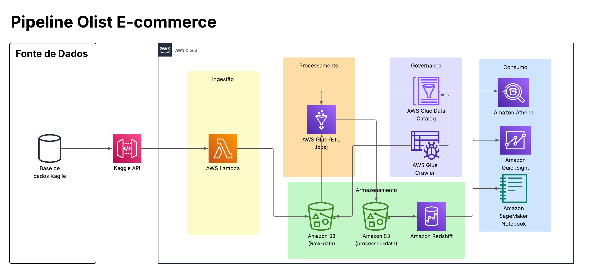

# Arquitetura de Dados Analíticos para o Case Olist E-commerce na AWS

## 1. Resumo Executivo

Este projeto documenta a concepção e implementação de um pipeline de dados end-to-end na nuvem AWS. A solução foi projetada para ingerir, armazenar, processar e analisar um conjunto de dados público de e-commerce da empresa Olist, demonstrando as melhores práticas de engenharia de dados. A arquitetura emprega um padrão moderno, combinando um Data Lake no Amazon S3, processos de ETL serverless com AWS Glue e um Data Warehouse no Amazon Redshift para análises de alta performance.

## 2. Diagrama da Arquitetura

## 3. Contexto de Negócio

No cenário atual, a capacidade de uma empresa de e-commerce tomar decisões baseadas em dados é um diferencial competitivo crítico. O objetivo deste pipeline é estruturar os dados da Olist para responder a perguntas de negócio fundamentais sobre vendas, clientes e logística, criando uma fundação escalável para análise de dados.

## 4. Fases do Pipeline e Tecnologias Utilizadas

A solução foi dividida em cinco fases lógicas:

#### Fase 1: Ingestão de Dados
* **Serviço:** AWS Lambda
* **Descrição:** Uma função Lambda em Python é executada para se conectar à API do Kaggle, baixar o dataset completo e depositá-lo na Zona Bruta do nosso Data Lake.

#### Fase 2: Armazenamento - O Data Lake
* **Serviço:** Amazon S3
* **Descrição:** O S3 serve como nosso Data Lake central, organizado em duas zonas:
    * **`raw-data` (Zona Bruta):** Armazena os arquivos CSV originais e imutáveis.
    * **`processed-data` (Zona Processada):** Armazena os dados após a limpeza e transformação, no formato colunar Parquet.

#### Fase 3: Governança e Processamento (ETL)
* **Serviços:** AWS Glue (Crawler, Data Catalog, ETL Jobs)
* **Descrição:** O Glue é o cérebro da transformação. O Crawler cataloga os dados brutos, e os Jobs de ETL (construídos no Glue Studio) leem esses dados, corrigem esquemas, renomeiam colunas, convertem tipos de dados e salvam o resultado limpo na zona processada.

#### Fase 4: Armazenamento - O Data Warehouse
* **Serviço:** Amazon Redshift
* **Descrição:** Para análises de BI de alta performance, os dados processados são carregados da zona processada do S3 para o Redshift, que funciona como nosso Data Warehouse.

#### Fase 5: Consumo e Análise
* **Amazon Athena:** Utilizado para consultas exploratórias e ad-hoc diretamente no Data Lake.
* **Amazon QuickSight:** Ferramenta de BI para criar dashboards interativos a partir dos dados no Redshift.
* **Amazon SageMaker:** Plataforma para desenvolvimento de modelos de Machine Learning.

## 5. Desafios Técnicos e Soluções

O principal desafio foi a falha do Glue Crawler em inferir corretamente o esquema dos arquivos CSV. A solução implementada foi criar um Classificador Customizado no Glue, forçando o reconhecimento do cabeçalho, e complementar com uma lógica de "override manual" nos Jobs de ETL para garantir a correção dos nomes e tipos das colunas.